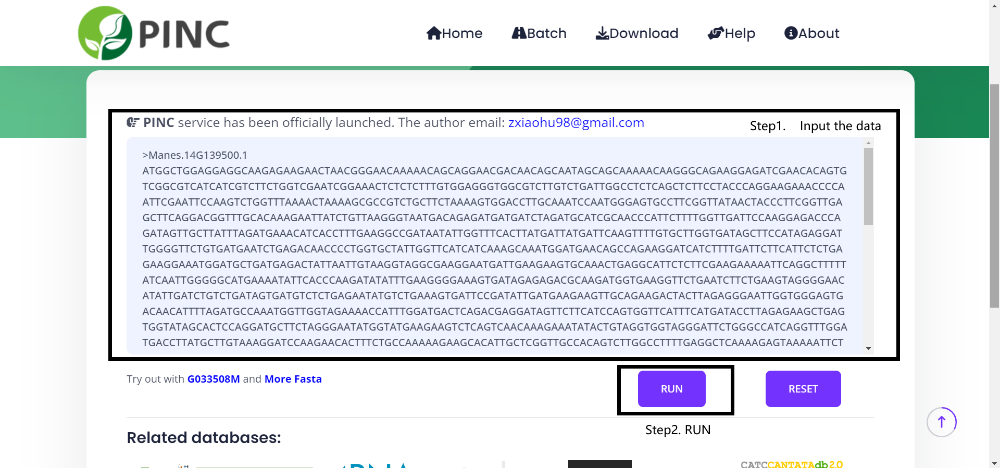

# PINC


A powerful tool for identifying non-coding RNAs in plants by analysing k-mer frequency, cds-related features, sequence length and GC content to distinguish between the growing number of non-coding RNAs and coding RNAs in plants.


## Features

- [x] High precision (ensemble learning)
- [x] Multiple high-performance base models
- [x] Convenience of use
- [x] Automated Forecasting
- [x] Web Online

## Documents

[Documentation](http://www.pncrna.com/help)

## Get Start

> There are multiple ways to run this tool, feel free to choose one of the following method.

### Run PINC  from Web Online (Fastest)

http://www.pncrna.com/

### Run PINC  from docker (Locally、Simply)

1. Download the PINC and Add the data file to the project directory.

```bash
git clone https://github.com/midisec/PINC
cd PINC
# upload the data file (example: data.fasta)
```

> All input data must be in [fasta format](./example_data.fasta)

2. Pull and build the environment image. (Time required)

```bash
sudo docker build -t pinc_images .
```

3. Create and Enter a new container.

```bash
sudo docker run -it pinc_images bash
```

4. Execute PINC for prediction

```bash
python pinc.py -f data.fasta
```


### Run PINC from source code (Complex)

1.  Installation Environment([Autogluon](https://github.com/awslabs/autogluon)、[kentUtils](https://github.com/ENCODE-DCC/kentUtils))

2. Clone project, install related dependencies

```bash
git clone https://github.com/midisec/PINC
cd PINC
pip3 install -r requirements.txt
```


3. Execute PINC for prediction

```bash
python pinc.py -f data.fasta
```


## Usage

### Command line version


#### Prediction

```
python pinc.py -f <data.fasta>
```


### Website online version

#### Prediction




After this, you will get a task page address with the uuid.

After that you can also check the history of the task by the uuid, usually it will be saved for **one month**.


View Results and Download results


## Introduction

### The Algorithm Framework/Process


### The DataSets

[The Training set data and validation set data (7 : 3).](./DataSets/TrainSets/)

| Species              | Coding | Non-coding | Total |
| -------------------- | ------ | ---------- | ----- |
| Arabidopsis thaliana | 2000   | 2000       | 4000  |
| Glycine max          | 2000   | 2000       | 4000  |
| Oryza sativa         | 2000   | 2000       | 4000  |
| Vitis vinifera       | 2000   | 2000       | 4000  |
| Total                | 8000   | 8000       | 16000 |

[The Testing set data.](./DataSets/TestSets/)

| Species            | Coding | Non-coding | Total  |
| ------------------ | ------ | ---------- | ------ |
| Cicer arietinum    | 2099   | 2099       | 4198   |
| Gossypium darwinii | 5622   | 5622       | 11244  |
| Lactuca sativa     | 4682   | 4682       | 9364   |
| Manihot esculenta  | 2808   | 2808       | 5616   |
| Musa acuminata     | 2059   | 2063       | 4122   |
| Nymphaea colorata  | 1708   | 1708       | 3416   |
| Solanum tuberosum  | 8282   | 8282       | 16564  |
| Sorghum bicolor    | 8657   | 8657       | 17314  |
| Zea mays           | 7406   | 7406       | 14812  |
| Total              | 51323  | 51327      | 102650 |

In the test set, the accuracy of the PINC ranged from 92.74% to 96.42%.


## Citations

```bibtex
@article{zhang2022pinc,
  title={PINC: A Tool for Non-Coding RNA Identification in Plants Based on an Automated Machine Learning Framework},
  author={Zhang, Xiaodan and Zhou, Xiaohu and Wan, Midi and Xuan, Jinxiang and Jin, Xiu and Li, Shaowen},
  journal={International Journal of Molecular Sciences},
  volume={23},
  number={19},
  pages={11825},
  year={2022},
  publisher={MDPI}
}
```

## Contributors

<a href="https://github.com/midisec/PINC/graphs/contributors"></a>
